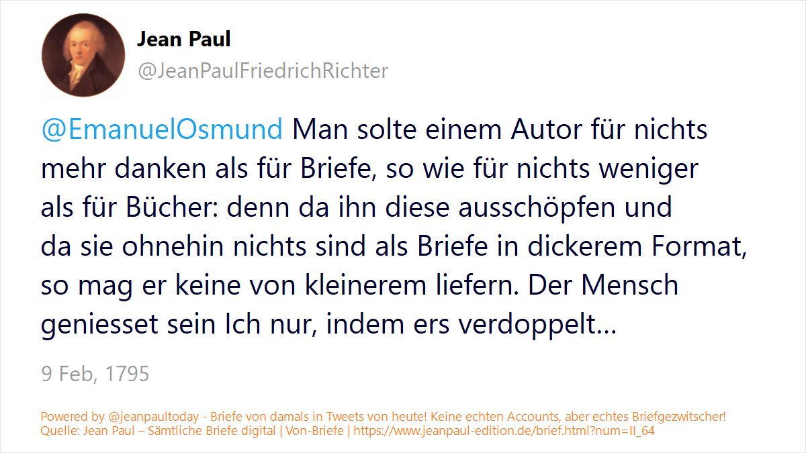

# @jeanpaultoday - Briefgezwitscher aus der Zeit um 1800 in den Social Media von heute

Der Twitter-Account [@jeanpaultoday](https://twitter.com/jeanpaultoday) macht täglich 280 Zeichen aus den Briefen des Dichters Jean Paul auf den Tag genau im Twitterverse verfügbar. Die Tweets, bei denen es sich um die Briefanfänge an verschiedene Empfängerinnen handelt, basieren auf folgender Edition:

_Digitale Neuausgabe der Briefe von Jean Paul (in der Fassung der von Eduard Berend herausgegebenen 3. Abteilung der Historisch-kritischen Ausgabe 1952–1964). Überarbeitet von Markus Bernauer, Norbert Miller und Frederike Neuber (Hrsg.), Berlin-Brandenburgischen Akademie der Wissenschaften 2018, in: Jean Paul - Sämtliche Briefe digital, dies. (Hrsg.), 2018ff. [Link zur digitalen Edition](https://www.jeanpaul-edition.de/) | [Datensatz auf Zenodo](https://doi.org/10.5281/zenodo.4109518)_ 

**Datengrundlage**

Für die Tweets wurden die Daten der digitalen Edition mit XSLT transformiert. Für jeden im Volltext vorliegenden Brief wurden die ersten 280 Zeichen ausgelesen (Briefe unter 280 Zeichen vollständig), wobei Briefkopf und Datumszeile davon ausgeschlossen wurden. Die Empfängerinnen der Briefe sind dem Text als (fiktive) @Twitteraccounts vorangestellt. 

Die so generierten 4467 Briefanfänge wurden mit Brieftitel, Quelle, Datum und Link als XML/TEI gespeichert. Da 4467 Briefanfänge auf ein Jahr gerechnet rund 12 Tweets pro Tag bedeuten würden, wurde die Anzahl der Tweets auf drei pro Tag beschränkt. Dazu wurde für jeden Brief eine beliebige Zahl generiert (tei:item/@n) und pro Tag die drei Briefanfänge mit dem höchsten Zahlenwert als Tweets für den Zeitraum 2022–2023 ausgewählt (wenn es für einen Tag weniger als drei Briefe gibt, dann gibt es auch weniger Tweets). 

Die Tweets werden ab 16.7.2022 täglich um 10.30 Uhr, 14:30 Uhr und 18:30 Uhr abgesetzt. Der Tweet-Text beinhaltet den Brieftitel, den Link zur Edition und die Hashtags #briefgezwitscher #jeanpaul #jeanpaultoday. Der eigentliche Brieftext ist einer Flashcard zu entnehmen, die in der Gestaltung einem Tweet nachempfunden ist. So gelangt Jean Pauls Briefkosmos in die Social Media unserer Zeit.

**Credits**

Für die Erstellung der Flashcards wurde eine Verarbeitungroutine von Torsten Roeder für den Twitter-Account [@satzomat](https://twitter.com/satzomat/) übernommen und angepasst. Die Tweets werden automatisiert vom webservice [Autochirp](https://autochirp.spinfo.uni-koeln.de/) veröffentlicht.

**Repositorium**

Folgende Dateien/Formate stellt das Repositorium zur Verfügung:

* Tweets von 15.7.2022-15.7.2023: 
  * tweets_sources_2022-2023.xml (Datengrundlage in XML/TEI) 
  * tweets_autochirp_2022-2023.tsv (Tweettexte für den Twitter-Bot)
  * flashcards (Tweetbilder als jpgs für den Twitter-Bot)
* Noch unpublizierte Tweets: tweets_UNPUBLISHED.xml

**Zitation und Lizenz**

Bitte zitieren Sie dieses Repositorium folgendermaßen:

Frederike Neuber: @jeanpaultoday - Briefgezwitscher aus der Zeit um 1800 in den Social Media von heute (GitHub-Repositorium), 2022, https://github.com/FrederikeNeuber/jeanpaultoday.

Für das Repositorium gilt die Lizenz CC-BY-SA 4.0.

